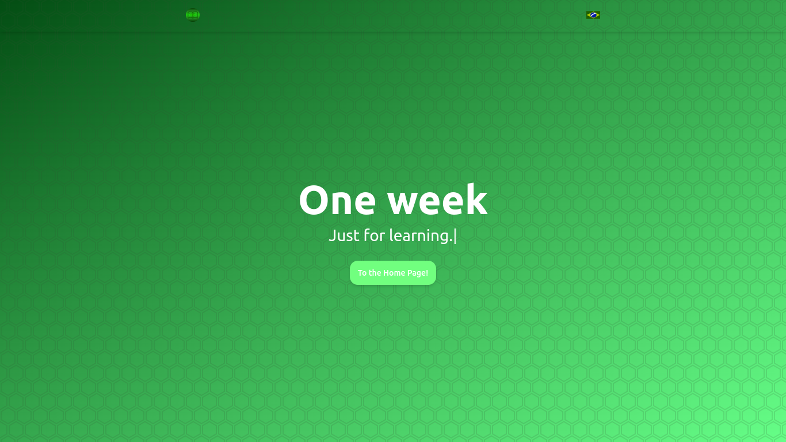
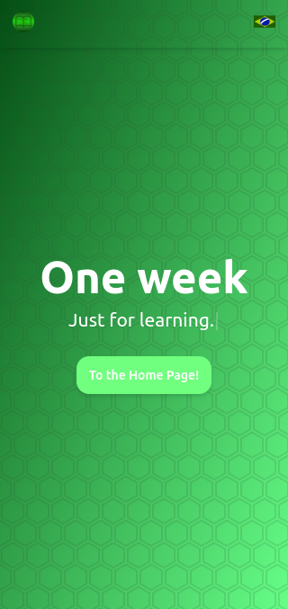

<h1 align="center" style="font-weight:bold;">Learning Week</h1>

  
   

---

## 📕 About

Learning Week is a personal project with the sole purpose of encourage apprenticeship.

The rules are:

**1**. You must learn something new every single day, independent of the previous knowledges, areas of activity etc.

**2**. Write a text documenting your new subject of study.

**3**. You can appear on the website to share more widely to more people using the site, send a message to me on discord or just do a PR if you feel confortable (This one is totally **optional**)

---

## ✨ Features

- **Responsivity**
- **Dynamic card rendering**

---

## ⚒️ Used Stack

- HTML5
- CSS3
- Javascript (Vanilla)

---

## ⚙️ Contributing

In case you want a PR to add your idea to the site, do the following steps:

**1**. First, create a dedicated page on the web/pages folder, following the current structure.

**2**. Add the necessary assets, such as images, styles and scripts on their respective folders.

**3**. Edit the web/data/home/pages.json, creating a new object on the cards entry according to the day of creation.

\*Please note that every and any entry to the json **MUST** follow the current structure. Feel free to experiment locally, and then create a PR when ready.

\*Also, pay attention to SEO, and add, at least, all the meta tags present on the homepage.

When done, the card will appear on the homepage as expected.

---

## 🔓 License

This project is under the MIT license. [Click here](/LICENSE) for more details.
