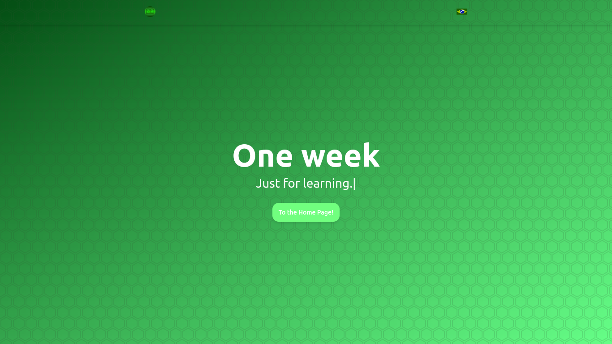
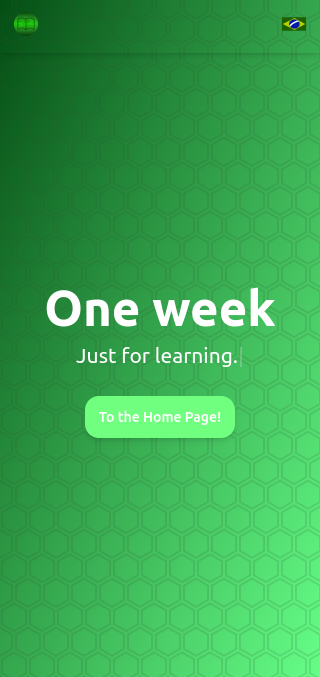

<h1 style="text-align: center; font-weight: bold;" >Learning Week</h1>

  
   

 
 
 
 
 
 

<h1 style="text-align:center;">⬇️What is the Learning Week?⬇️</h1>
 
 

Learning Week is a personal project with the pure purpose of incentive the knownledge.

The rules are:

**1.** You must learn something new every single day, indenpendent of the previous knowledges, areas of activity etc.

**2.** Write a text documenting your new subject of study.

**3.** You can appear on the website to share more widely to more people using the site, send a message to me on discord or just do a PR if you feel confortable (This one is totally **optional**)

 
 
 

---

<h1 style="text-align:center;">⬇️Whow the card system works?⬇️</h1>
 
 

In case you want a PR to add your idea to the site, do the following steps:

**1.**
**2.**
**3.**

 
 
 

---

<h1 style="text-align:center;">⬇️Features⬇️</h1>
 
 

- **Responsivity**

- **Dynamic card render**

 
 
 

---

<h1 style="text-align:center;">⬇️License⬇️</h1>

This project is under the MIT license. Check out [here](/LICENSE) for more details.
